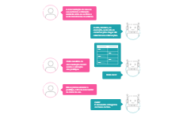

    <h1 align=center>CAPÍTULO 5</h1>

>**Capítulo 5 - Documentando Casos de Uso**

# CONCEITO DAS ESPECIFICAÇÕES DE *CASOS DE USO*

Um caso de uso é realizado por meio de cenários. Conforme definido em fases anteriores, um cenário é uma descrição de uma das maneiras pelas quais um caso de uso pode ser executado ou realizado (Bezerra, 2015). Cada cenário possui um conjunto de passos, mostrando como as ações e interações se desdobram, ou seja, como um caso de uso é executado.

A realização do caso de uso permite organizar os artefatos relacionados ao caso de uso e elaborar os diagramas de classes e de sequência que expressam o comportamento do caso de uso em termos de objeto.

Conforme Cockburn (2007, p. 32), as especificações dos casos de uso são essenciais porque elas narram situações coerentes de como o sistema irá se comportar em uso. Consequentemente, as partes interessadas, mesmo se forem leigas do ponto de vista técnico de desenvolvimento de software, conseguem enxergar o que esse novo sistema será.

## Documentação de Caso de Uso

Conforme Bezerra (2015, p. 55), “cada caso de uso se define pela descrição narrativa (textual) das interações que ocorrem entre o(s) elemento(s) e o sistema”.

Além da modelagem gráfica, o Diagrama de Caso de Uso deve possuir a descrição textual, que chamaremos de documentação de caso de uso.

Os passos que compõem a descrição textual do caso de uso devem ser escritos em forma funcional, objetiva e clara para o leitor.

(<a href="#readme-top">back to top</a>)

## Objetivos da Documentação de Caso d eUso

A documentação de caso de uso tem como objetivos:

- Permitir especificar o comportamento do sistema
- Fazer descrição textual do caso d euso e narrar o cenário do requisito funcional
- Oferecer detalhes ao leitor sem minúcias técnicas e detalhar também a visão do sistema sobre o negócio
- Auxiliar na validação do protótiopo
- Esclarecer a interação existente entre os atores e as funcionalidades do sistema

A imagem “Objetivos da documentação de caso de uso” descreve os objetivos da documentação de caso de uso (user case)

(<a href="#readme-top">back to top</a>)

## Grau de Detalhamento do Caso de Uso

O grau de detalhamento empregado na descrição de um caso de uso pode variar desde o mais resumido até a narração com muitos detalhes. O nível de detalhamento depende do nível de complexidade da interação entre os atores e o sistema.

(<a href="#readme-top">back to top</a>)

## Modelo da Documentação de Caso de Uso

O modelo de documentação de caso de uso se refere à estrutura empregada para dispor a sua narrativa textual.

A UML não estabelece um modelo específico a ser utilizado na descrição textual de um caso de uso, portanto, há vários templates da documentação de caso de uso.

Conforme Bezerra (2015, p. 56), utilizaremos o modelo tabular cuja sequência de interações entre o ator e o sistema é dividida em duas colunas de uma tabela. Essa estrutura de descrição tem o objetivo de desmembrar as ações entre os atores e o sistema.

| Ator                                           | Sistema                                         |
|:-----------------------------------------------|:------------------------------------------------|
| FP01 - O cliente seleciona "Cadastrar cliente" |                                                 |
|                                                | FP02 - Exibir a página "Dados do Cliente"       |
| FP01 - O cliente informa o nome                |                                                 |
|                                                | FP04 - Receber o nome - **FE01**                |
| FP01 - O cliente informa o endereço da entrega |                                                 |
|                                                | FP06 - Receber o endereço de entrega - **FE02** |
| FP01 - O cliente informa o telefone            |                                                 |
|                                                | FP08 - Receber o telefone - **FE03**            |
| FP01 - O cliente informa o CPF                 |                                                 |
|                                                | FP010 - Receber o CPF - **FE04**                |
> Modelo tabular de documentação de caso de uso

(<a href="#readme-top">back to top</a>)

## Itens que Auxiliam a Elaboração da Documentação do Caso de Uso

### Lista por Objetivo

A lista por objetivo pode ser elaborada ao se enumerar todos os casos de uso, expondo o conteúdo funcional do sistema, e inserindo apenas as funcionalidades que realmente serão implementadas pelo sistema. Por meio desta lista, teremos a visão geral do sistema. É possível utilizar uma tabela para auxiliar na elaboração dessa lista, conforme exemplificado no Quadro “Lista por Objetivo”.

| Ator        | Objetivo em nível de tarefa | Prioridade |
|:------------|:----------------------------|:-----------|
| Cliente     | Consultar cerveja           | 2          |
| Funcionário | Cadastrar cerveja           | 1          |
> Lista por objetivo

### Condições de Falha

Identifique as possibilidades de erros que podem ocorrer em cada caso de uso sendo documentado. Especifique essas falhas antes de detalhar como o sistema deverá tratá-las.

### Tratamento da Falha

Descreva como o sistema deve responder a cada falha. Verifique se há alguma regra de negócio relacionada ao assunto – ou seja, em caso de falha, o que o sistema deve fazer? Será que deve exibir uma mensagem ao cliente? Ou então deve direcioná-lo a outro caso de uso, seguindo um fluxo alternativo? Questões como estas precisam ser documentadas para avaliação e discussão.

(<a href="#readme-top">back to top</a>)

## Template da Documentação de Caso de Uso

### Título do caso de uso

O nome do caso de uso deve ser o mesmo nome utilizado no Diagrama de Caso de Uso.

### Identificador

É um código único utilizado para identificar a descrição de um cenário do caso de uso. O identificador é importante porque deixa claro que cada caso de uso é único, e não pode ser confundido com outros casos de uso parecidos, porém diferentes.

### Sumário

Especifica uma breve descrição sobre a funcionalidade (caso de uso).

### Ator

Lista o(s) ator(es) envolvido(s) no caso de uso.

### Ator primário

O ator que inicia a interação com o sistema para alcançar um objetivo.

### Ator secundário

Representa os demais participantes do caso de uso, se houver. Muitos atores podem entrar nesta categoria, ou até mesmo nenhum.

### Pré-condição

Identifica outro caso de uso que deve ocorrer antes desse; hipótese que deve ser verdadeira antes da execução deste caso de uso. Pode conter nenhuma ou mais pré-condições. Por exemplo: para determinado caso de uso, é pré-condição que o cliente tenha cadastro no sistema e esteja logado.

### Fluxo Principal

Descreve o passo a passo da interação entre o ator e o sistema na execução do caso de uso; ou seja, o que normalmente acontece quando um caso de uso é executado.

### Fluxo Alternativo

Descreve o que ocorre quando o ator faz uma escolha alternativa diferente da citada no Fluxo Principal. Um Fluxo Alternativo descreve um comportamento alternativo para a execução do Fluxo Principal, que substitui parte do comportamento do Fluxo Principal. Por exemplo, no caso de um cliente que acessa um site de e-commerce especializado em cerveja: o fluxo principal é quando o cliente acessa, faz login, seleciona um produto e finaliza a compra. Um dos fluxos alternativos seria uma alteração no pedido antes do pagamento, como aumentar ou reduzir a quantidade de itens no carrinho de compras.

### Fluxo de Exceção

Um evento que impede que o caso de uso seja concluído, ou seja, o que pode ocorrer de excepcional durante aquele cenário. Complementa o comportamento do Fluxo Principal do caso de uso base, porém não substitui parte do comportamento do Fluxo Principal.

As exceções indicam, na descrição do caso de uso, as situações que devem ser tratadas pelo sistema, tais como:

- Comportamentos indesejados.
- Algo que possa interromper o funcionamento do sistema.
- Situação de inconsistência.
- Violações às regras de negócio.
- Algo inesperado.
- Falhas.

### Pós-condição

Identifica um cenário ou uma situação gerada após o caso de uso ser realizado.

### Regras de Negócio

A especificação de um caso de uso pode fazer referência a uma ou mais Regras de Negócio.

Números nos Fluxos de Exceção ou Alternativos referem-se aos números dos passos no cenário do Fluxo Principal (FP), nos quais cada situação diferente é detectada (por exemplo, os passos 2a e 3b indicam condições diferentes que podem aparecer no passo 2).

(<a href="#readme-top">back to top</a>)
